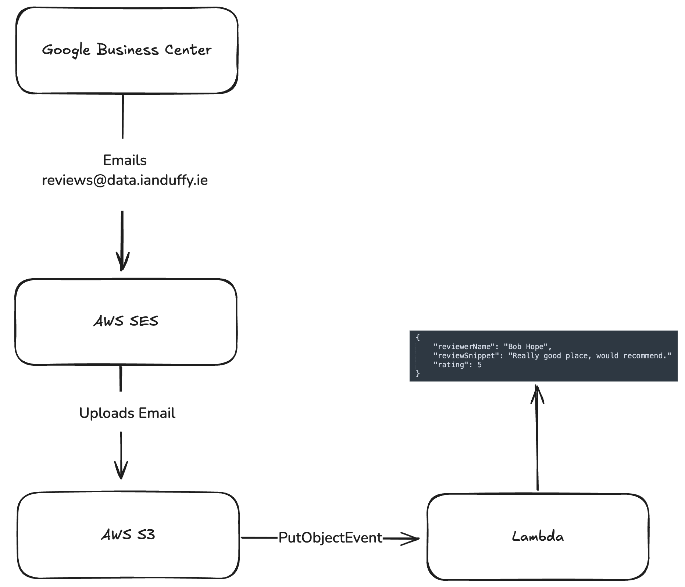

# Google Review Email Processor

This project contains an AWS Lambda function that processes emails from Google Business Center and extracts review information. It's designed to automatically handle incoming review notifications and store the relevant data.

## Project Structure

- `google-review-email-processor/`: Main directory for the Lambda function
  - `src/`: Source code for the Lambda function
  - `tests/`: Test files and fixtures
  - `scripts/`: Build and scripts

## Scripts

- `npm test`: Run tests
- `npm run lint`: Lint code
- `npm run lint:fix`: Lint and auto-fix issues
- `npm run format`: Format code with Prettier
- `npm run build`: Create deployment package
- `npm run deploy`: Lint, test, and build

## Infrastructure

The project uses Terraform to manage the AWS infrastructure. Key components include:

- S3 bucket for storing incoming emails
- SES receipt rule for handling incoming emails
- Lambda function for processing emails

For more details on the infrastructure, refer to the `main.tf` file.

## Deployment

```bash
terraform init
terraform apply
```

## Development

- The project uses ESLint for linting and Prettier for code formatting.
- Pre-commit hooks are set up to ensure code quality before committing.

## Testing

The project includes test fixtures for valid and invalid email formats. To run tests:

```bash
npm test
```
